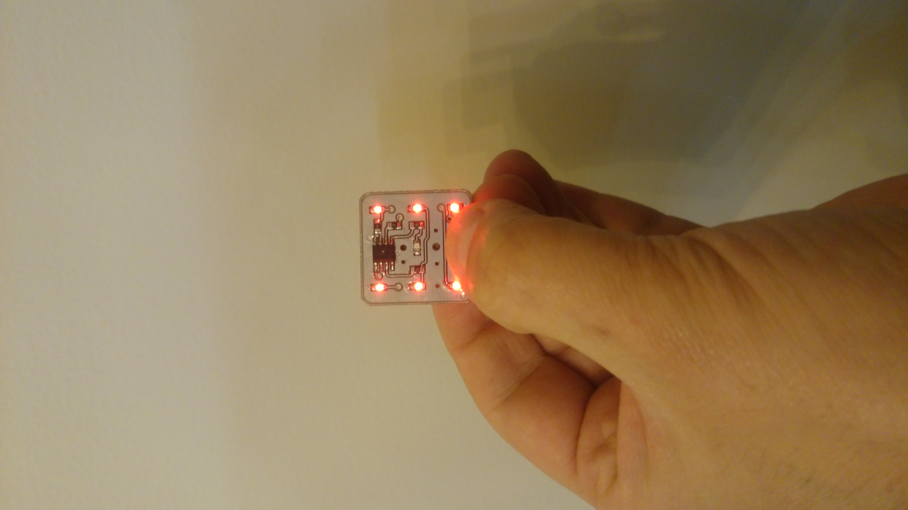

# A small 1 Inch square Dice
A simple dice using a Microchip PIC12F629 microcontroller

## Schematic

## PCB

## Assembled board

# Credits
This project is more or less based on [Colin Mitchell's article](http://www.talkingelectronics.com/projects/LED%20Dice%20with%20PIC/Dice.html) for [Talking Electronics](https://en.wikipedia.org/wiki/Talking_Electronics) magazine. 

# To do
It would be much better to keep the PIC always powered on but in Sleep mode or Watchdog timer.
After switch is pressed, PIC should resume normal operation and roll the dice.
Then it could switch back to Sleep mode one minute after showing the result.
I have to study PIC12F1822 (which I am currently using) documentation to learn how to use Sleep mode.

# License
This hardware is licensed under [Creative Commons Share Alike](http://creativecommons.org/licenses/by-sa/4.0/).
