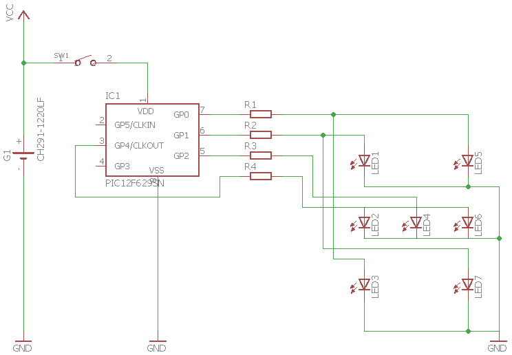
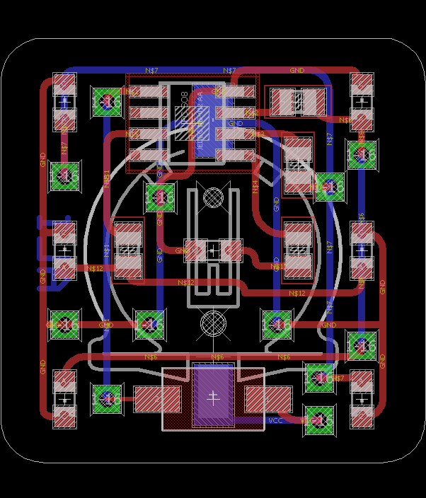

# A small 1 Inch square Dice
A simple dice using a Microchip PIC12F629 microcontroller

## Schematic

## PCB

# Credits
This project is more or less based on [Colin Mitchell's article](http://www.talkingelectronics.com/projects/LED%20Dice%20with%20PIC/Dice.html) for [Talking Electronics](https://en.wikipedia.org/wiki/Talking_Electronics) magazine. 

# License
This hardware is licensed under [Creative Commons Share Alike](http://creativecommons.org/licenses/by-sa/4.0/).
